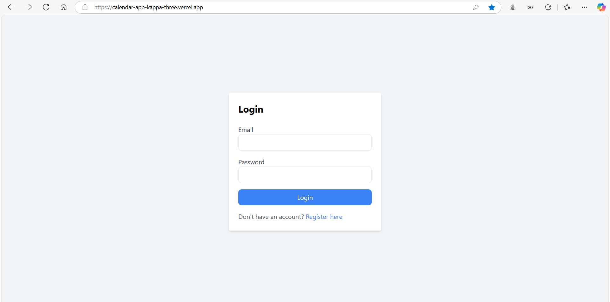

# Project Name

This is a task management and scheduling application that helps users track overdue and scheduled communications using a calendar interface. It supports role-based login for admins and users, offering distinct dashboards and functionality.

- Vercel deployed link - https://calendar-app-kappa-three.vercel.app/
- Backend deployed link (render) - https://calendar-app-o6v0.onrender.com

## Features

1. **Role-Based Login:**
   - Admins and users have separate dashboards with distinct functionality.
2. **User Dashboard:**
   - Displays overdue tasks and today's tasks.
   - It contains notifications section where the count of overdue tasks and today's tasks get updated dynamically according to the scheduled communications and the communications logged.
   - Table shows company name, details of last 5 communications in sorted order and next communication date(+14 days by default).
   - Overdue tasks in red colour and due today tasks in yellow colour.
   - By clicking on "Log Communication" button, users can save the communication details.
   - Tool tip which shows notes of last 5 communications while hovering.
   - Interactive calendar to view previous and scheduled communications.

3. **Admin Dashboard:**
   - Admin can add company names and details with the default communication time of 2 weeks. The communications are dynamically scheduled for every 2 weeks and visible to the users in the calendar.
   - Admin can add communication methods and also can edit/delete these methods. Admin can add these methods with the required sequence and these methods are visible in the admin dashboard in the increasing order of sequence.
4. **Calendar View:**
   - View past and upcoming communications.
   - Clickable dates to view communication details in sidebar.
5. **Responsive Design:**
   - Fully responsive interface using Tailwind CSS.
6. **Secure Login:**
   - Implements JWT-based authentication.
7. **Logout Functionality:**
   - Users can securely log out, clearing local storage data.

## Technology Stack

### Frontend:
- Framework: React.js + Vite
- CSS: Tailwind CSS
- State Management: React hooks
- Calendar view - Full Calendar
- Deployment: Vercel

### Backend:
- Framework: Node.js with Express.js
- Database: MongoDB 
- Authentication: JWT
- Deployment: Render

## Setup Instructions

### Prerequisites:
1. Node.js installed on your local machine.
2. MongoDB instance running (local or cloud-based).
3. Vercel account for frontend deployment.
4. Render account for backend deployment.

### Steps to Run Locally:

1. **Clone the Repository:**
   ```bash
   git clone <repository-url>
   cd <repository-folder>

2. ### **Setup Backend:**
    1. Navigate to backend folder
        ```powershell
        cd backend

    2. Install dependencies:
        ```powershell
        npm install

    3. Create a .env file and configure
        ```makefile
        PORT=5000
        MONGO_URI=<your-mongodb-uri>
        JWT_SECRET=<your-secret-key>
    
    4. Start backend server
        ```powershell
        npm run dev

3. ### **Setup Frontend:**
    1. Navigate to backend folder
        ```powershell
        cd ../frontend

    2. Install dependencies:
        ```powershell
        npm install

    3. Update the API base URL in the frontend code (if needed) to point to your backend:
        ```javascript
        const baseURL = "http://localhost:5000"; 

    
    4. Start backend server
        ```powershell
        npm run dev


## Login Information

To access the application, use the following credentials:

### Admin:
- **Email:** `admin@example.com`
- **Password:** `123123`

### User:
- **Email:** `user@example.com`
- **Password:** `123123`

### Important Note:
If the login process does not work on the first attempt (especially when switching roles), try logging in 5-6 times. This might occur due to token clearance delays.

If any unwanted things happen during login, please go back and try to login again.


## Screenshots

### **Login Page**


### **Admin Dashboard**


### **Admin Dashboard - Edit Company**


### **Admin Dashboard - Add Method**


### **Admin Dashboard - Edit Method**


### **User Dashboard**


### **User Dashboard - Tooltip which displays notes of last 5 communications**


### **User Dashboard - Log communication**


### **User Dashboard- Calendar View and side bar which displays communication details by clicking on the date**

